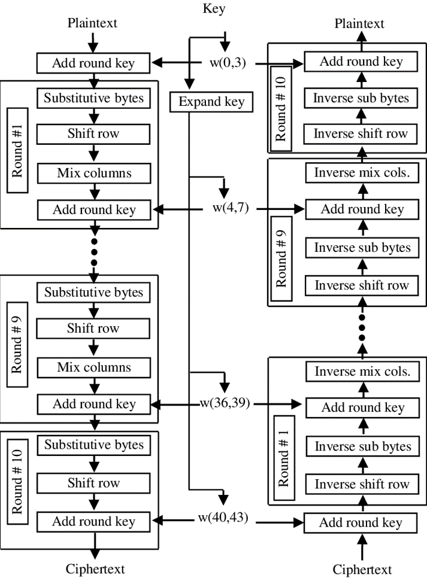

# AES Encryption Design (AES-128/192/256)

This repository contains the design and implementation of the Advanced Encryption Standard (AES) with support for 128-bit, 192-bit, and 256-bit key lengths. AES is a widely adopted symmetric encryption algorithm, ensuring high levels of data security for various applications.

## Key Features of AES

- **Flexibility**: Configurable design allows easy switching between key lengths (128, 192, and 256 bits) as needed.
- **Security**: Exponantial relation between security and key length
- **Efficiency**: Optimized for resource utilization, suitable for real-time applications.

## Methodology

- **Learning Phase**: Comprehensive understanding of AES including key expansion, rounds operations as mix columns.
- **Hardware Design**: The AES design is modeled in Verilog.
- **Simulation**: The design is tested using the test vectors provided in FIPS Publication 197 with the ModelSim simulator to verify functionality.
- **Synthesis**: The design is synthesized using Xilinx Vivado achieving  90MHz clock frequency without setup violations.
- **Target**: Targeted for the Zynq UltraScale+ MPSoC ZCU104 FPGA.

## Resources

- [NIST FIPS-197 AES](https://nvlpubs.nist.gov/nistpubs/fips/nist.fips.197.pdf)

## Author

- ***Khalid Hesham***
